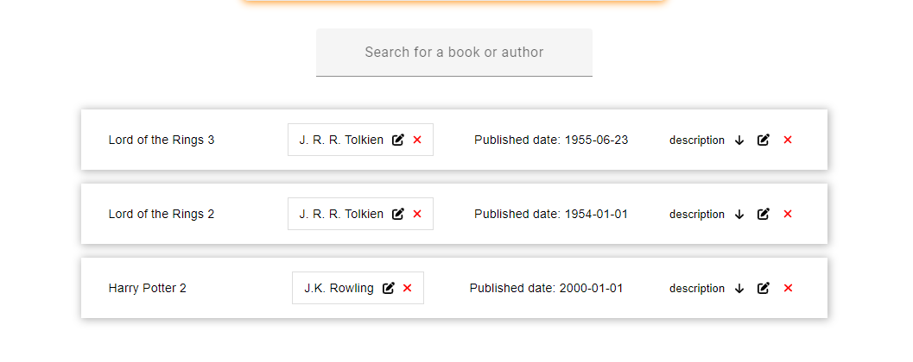

# Book Search Project

This is a CRUD application developed using Angular as the client-side framework and Laravel as the backend RESTful API. It allows users to manage books and authors data.

## Link to the deployed site
The site is deployed as follows,  

client side - netlify  

server side - railway  

database - db4free - **Note! The data base is in a free service, So requests are very slow. If you use the deployed site, be patient.**  

To get the fast version, download and install it on your computer as detailed below.  
  
  
https://cheery-dieffenbachia-29b1a6.netlify.app/

## Installation

Follow these steps to set up the project:

1. Clone the repository to your local machine:  
```git clone <repository_url>```  
  
  
2. Navigate to the project folder:  
```cd Book-search```  
  
  
3. Backend Setup:  
- Navigate to the backend folder:  
```cd Book-search-backend```  
  
- Install the required dependencies:  
```composer install```  
- Rename the `.env.example` file to `.env` and update the database connection details.

- Generate an application key:  
```php artisan key:generate```  
- Run the database migrations to create the necessary tables:  
```php artisan migrate```  
  
4. Frontend Setup:  
- Navigate to the frontend folder:  
```cd Book-search-frontend```  
 
- Install the required dependencies:  
```npm install```  
  
  
5. Run the Application:  
- Start the backend server:  
```php artisan serve```  
 
- Start the frontend server:  
```ng serve```  

6. Access the application in your browser at `http://localhost:4200`.  
## Database Schema

The project uses MySQL as the database. Below are the table schemas for the `books` and `authors` tables:

### Books

```sql
CREATE TABLE books (
  id INT(10) UNSIGNED AUTO_INCREMENT PRIMARY KEY,
  title VARCHAR(255) NOT NULL,
  description TEXT,
  published_date DATE,
  author_name VARCHAR(255),
  author_id INT(10) UNSIGNED,
  created_at TIMESTAMP DEFAULT CURRENT_TIMESTAMP,
  updated_at TIMESTAMP DEFAULT CURRENT_TIMESTAMP ON UPDATE CURRENT_TIMESTAMP
);
```  
  
### Authors  
  
```CREATE TABLE authors (
  id INT(10) UNSIGNED AUTO_INCREMENT PRIMARY KEY,
  name VARCHAR(255) NOT NULL,
  email VARCHAR(255),
  numOfBooks INT(10) UNSIGNED,
  created_at TIMESTAMP DEFAULT CURRENT_TIMESTAMP,
  updated_at TIMESTAMP DEFAULT CURRENT_TIMESTAMP ON UPDATE CURRENT_TIMESTAMP
);
```  
  
  
### Importing SQL Schema  

in the base folder of the project you can find a SQL Schema folder that contains the SQL Schema files,
If you download the SQL schema files, you can import them into your MySQL database to create the necessary tables and schema. Follow these steps:

1. Open MySQL Workbench or any other MySQL management tool.  
  
  
2. Connect to your MySQL server.  
  
  
3. Create a new database for your project if you haven't already done so. You can use the following command to create a new database in MySQL Workbench:    
```CREATE DATABASE your_database_name;```  
  
4. Select the newly created database as the active database. 
  
  
5. Locate the SQL schema file in the "SQL Schema" folder within the base folder of the project. It should have a .sql file extension.  
  
  
6. Open the SQL schema file using a text editor and copy its contents.  
  
  
7. In your MySQL management tool, open a new SQL editor window or query tab.   
  
  
8. Paste the contents of the SQL schema file into the SQL editor window.  
  
  
9. Execute the SQL statements by clicking on the "Execute" or "Run" button in your MySQL management tool. This will create the necessary tables and schema in your database.  
  
  
Repeat the above steps for each SQL schema file you have downloaded.

Once you have imported the SQL schema into your database, make sure to configure the database connection settings in your Laravel project's .env file to match your local MySQL database configuration.  


## Usage

The application provides the following features:

1. Listing Objects: The application displays a table that lists books and authors. The lists are dynamically updated based on changes made to either the books or authors.

2. Creating Objects: Users can use the provided form to create new books and authors. Simply fill in the required information and submit the form.

3. Deleting Objects: Each object in the table has a delete button that allows users to remove the author or the book.

4. Updating Objects: Users can edit the details of a book or author using the provided form. Simply select the object from the table and modify the desired fields.

5. Filtering by Book Name: Users can search for authors of a specific book by filtering the list using the book name. Enter the book name in the search field, and the table will update to show only the authors associated with that book.

6. Filtering by Author Name: Users can search for books written by a specific author by filtering the list using the author name. Enter the author name in the search field, and the table will update to show only the books written by that author.

Additional Features:

- Quantity Tracking: The application tracks the number of books written by each author. The quantity is automatically updated whenever a book is added, deleted, or modified.

- Error Handling: The application handles errors that may occur during API requests or server interactions. Error messages are displayed to the user using Toastr notifications.

- Autocomplete Search: The search functionality includes autocomplete suggestions based on the available book and author names. This provides a convenient way for users to find the desired objects.

Please note that this is a basic overview of the project features. Refer to the source code and relevant documentation for detailed implementation and customization.
  
  
## Example  
  
### Inserting a new author and a new book:  


 ### Authors and books search and below that a display of all the books with editing and deletion options for both authors and books:
 


 

 

 

